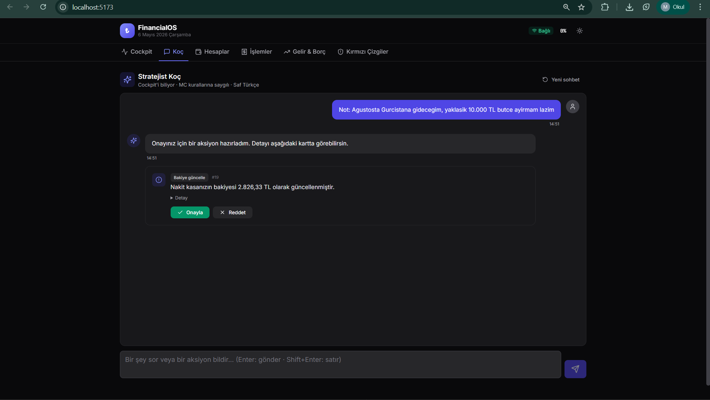
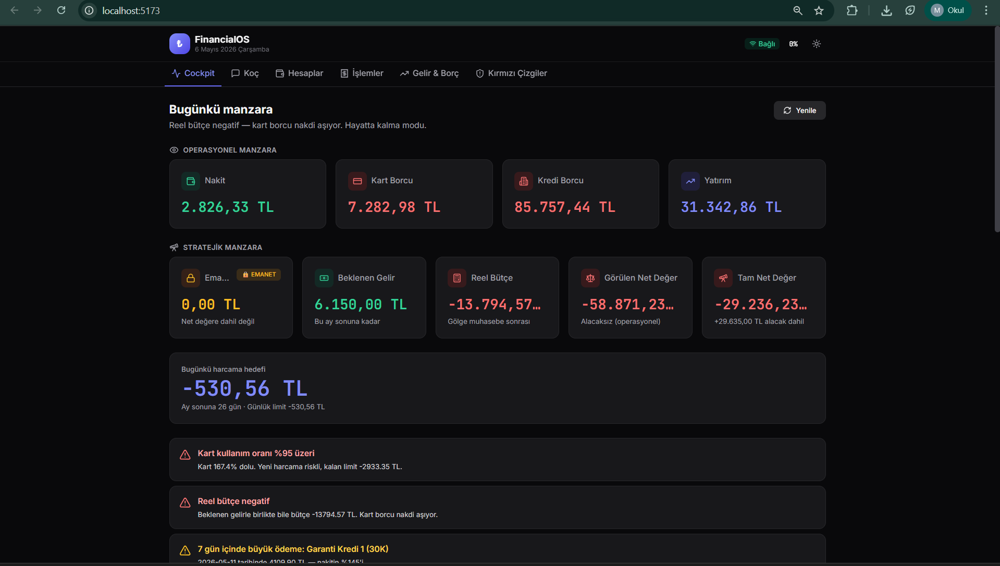

# FinancialOS

> Kişisel finans işletim sistemi — hesabı kurallar motoru yapar, anlatımı LLM yapar.

[]()
[]()
[]()
[]()
[]()

🇬🇧 [English README](README.md)

FinancialOS uçtan uca bir kişisel finans uygulamasıdır: borç ve alacakları takip eder, birden fazla nakit hesabını ve kredi kartını yönetir, kullanıcının tanımladığı sert kuralları ("kırmızı çizgileri") uygular ve doğal dilde sohbet edilebilir bir koç paneli sunar — kararı yalnızca *anlatmaz*, *neden* öyle olduğunu da açıklar.

Mimari tek bir prensibe dayanır: **kararı kurallar motoru verir, açıklamayı LLM yapar.** Hesaplamalar deterministik ve denetlenebilir kalır; sadece anlatım katmanı üretkendir.

---

## Bu proje neden var?

Çoğu kişisel finans uygulaması ya size ham sayılar gösterir (Mint, YNAB) ya da kararı tamamen LLM'e bırakır (ki o da matematik halüsinasyonu yapar). FinancialOS ikisinin arasında durur: her sayıyı Python deterministik olarak hesaplar, LLM'e bu sonuç doğrulanmış veri olarak verilir, böylece doğal Türkçe ile sayı uydurmadan cevap verebilir.

Maliyeti: daha fazla kod. Faydası: her koç cevabı veritabanındaki bir satıra kadar izlenebilir.

---

## Mimari

```
┌─────────────────────────────────────────────────────────────┐
│  Frontend  (React + Vite + Tailwind)                        │
│  Cockpit · Koç · Hesaplar · İşlemler · Gelir-Borç           │
│  · Kırmızı Çizgiler                                         │
└──────────────────────────┬──────────────────────────────────┘
                           │ REST
┌──────────────────────────▼──────────────────────────────────┐
│  FastAPI  (35 endpoint, 11 router)                          │
│  ┌───────────────────────────────────────────────────────┐  │
│  │  Katman 1 — is_question() ön-sınıflandırıcı (Python)  │  │
│  │  Katman 2 — Kurallar Motoru (deterministik kararlar)  │  │
│  │  Katman 3 — Action Executor (yazma tarafı, idempotent)│  │
│  │  Katman 4 — Fund Tracker (FIFO lot bazlı yatırım)     │  │
│  │  Katman 5 — Simulation Engine (what-if projeksiyonu)  │  │
│  │  Katman 6 — Coach (LLM, salt-okunur, açıklama yapar)  │  │
│  │  Katman 7 — FallbackProvider (çoklu LLM orkestrasyon) │  │
│  └───────────────────────────────────────────────────────┘  │
└──────────────────────────┬──────────────────────────────────┘
                           │
                  ┌────────┴────────┐
                  │  SQLite (SQLAlchemy)  │
                  └─────────────────┘
```

### LLM sağlayıcı zinciri

Özel yazılmış bir `FallbackProvider`, dört ücretsiz tier sağlayıcıyı orkestre eder. Bir sağlayıcı hata, boş cevap veya rate limit dönerse otomatik olarak sıradakine geçilir:

```
Groq (Llama 3.3 70B) → Cerebras (Qwen-3 235B) → Gemini Flash-Lite → OpenRouter
```

Zincir environment değişkenleriyle yapılandırılır; sıralama kod değişikliği yapmadan değiştirilebilir. Sadece sıralama değiştirmek geliştirme sırasında üç farklı bug'ı çözdü (prompt sızıntısı, davranış regresyonu, tool-call tutarsızlığı).

---

## Önemli mühendislik kararları

**Deterministik ön-sınıflandırıcı.** `coach.py` içindeki `is_question()` fonksiyonu, kullanıcı mesajının soru mu bildirim mi olduğuna LLM'e ulaşmadan *önce* karar verir. Bu, kırılgan LLM-bağımlı bir sınıflandırmayı unit-test edilebilir Python fonksiyonuna taşıdı — cevap tutarlılığında ölçülebilir iyileşme sağladı.

**Tarih aritmetiği prompt'ta değil, Python'da.** LLM'ler "bugünden X gün sonra" hesaplarında güvenilmez. `turkish_date()` ve `_day_suffix()` yardımcıları "yarın / 3 gün sonra / 2 gün vadesi geçmiş" formatlamasını backend'de üretir, hazır metni LLM'e geçer. LLM hiçbir zaman çıkarma işlemi yapmaz.

**Kategori normalizasyonu açık override ile.** Kullanıcı *"260 TL market alışverişi yaptım Enpara nakitten"* dediğinde, kategori sözlüğü varsayılan olarak kredi kartına yönlendirir. `_normalize_transaction_payload` içindeki guard clause, LLM açıkça `account_id` belirttiyse onu korur — kullanıcı niyeti sistem varsayılanını yener.

**Tool-aware history.** `CoachMemory` tablosu hem `assistant` satırlarını (`tool_calls_json` ile) hem de `tool` satırlarını (sonuçlarla) tutar. History yeni bir LLM çağrısına yeniden oynatıldığında `_to_openai_messages()` adaptörü OpenAI tool-calling formatını yeniden kurar. Farklı sağlayıcılar (Groq, Cerebras, Gemini, OpenRouter) bekledikleri mesaj şeklini alır.

**Kart limit uyarısı, kart limit bloğu değil.** Bir işlem kredi limitini aşacaksa motor aksiyonu reddetmek yerine bir `warning` alanı döner. Kullanıcı bilgilendirilir ama karar yetkisi onda kalır. Bu "Kurallar Motoru = sert ret" kalıbından bilinçli bir sapmaydı — kurallar motoru bilgilendirilmiş seçim için meta-veri de sunabilir.

---

## Teknoloji yığını

| Katman | Teknoloji |
|--------|-----------|
| Backend | FastAPI · SQLAlchemy · Pydantic · SQLite |
| Frontend | React 18 · Vite · Tailwind CSS |
| LLM | Groq · Cerebras · Google Gemini · OpenRouter |
| Araçlar | Git · PyCharm · asistan araci · MCP |

---

## Proje yapısı

```
financialos/
├── app/                       # Backend
│   ├── routers/               # 11 router, 35 endpoint
│   ├── coach.py               # LLM orkestrasyon, FallbackProvider
│   ├── rules_engine.py        # Deterministik kararlar
│   ├── action_executor.py     # Yazma tarafı, idempotent
│   ├── fund_tracker.py        # FIFO yatırım lotları
│   ├── simulation_engine.py   # What-if projeksiyonu
│   └── models.py              # SQLAlchemy modelleri
├── frontend/                  # React uygulaması
│   └── src/
│       ├── panels/            # 6 panel
│       └── components/        # 8 component
├── docs/                      # Mimari, geliştirme komutları, yol haritası
├── scripts/                   # Kurulum, demo veri
└── PROJE.md                  # AI destekli geliştirme notları
```

---

## Ekran görüntüleri




---

## Yerel kurulum

> Repo `.env` ve veri yüklü veritabanı olmadan dağıtılır. En az bir LLM sağlayıcısı için API anahtarına ihtiyacınız olacak.

```bash
# 1. Backend
python -m venv .venv
.venv\Scripts\activate            # Linux/Mac: source .venv/bin/activate
pip install -r requirements.txt
cp .env.example .env              # API anahtarlarını doldur
python -m scripts.setup_data      # demo veri yükle
uvicorn app.main:app --reload --port 8000

# 2. Frontend (ikinci terminalde)
cd frontend
npm install
npm run dev                       # http://localhost:5173
```

### Ortam değişkenleri

```env
GROQ_API_KEY=...
CEREBRAS_API_KEY=...
GEMINI_API_KEY=...
OPENROUTER_API_KEY=...
LLM_PROVIDER=fallback
```

Dört sağlayıcıdan herhangi biri sistemi çalıştırmak için yeterlidir; FallbackProvider yapılandırılmamış sağlayıcıları otomatik atlar.

---

## Durum

Aktif geliştirme. Wave-1 stabilizasyonunda 22 bug sistematik olarak kapatıldı; Wave-2'de tool-aware history, deterministik kategori normalizasyonu ve dört sağlayıcılı LLM zinciri dahil 21 fix daha eklendi. Her bug için kök neden, fix ve doğrulama notu içeren ayrı log tutuluyor.

Bu kişisel bir projedir — tek başına geliştirildi, esas olarak üretim seviyesinde mimari kararlar, sistematik debug ve deterministik sistemler ile üretken AI arasındaki sınırı düşünmek için bir alan olarak.

---

## Lisans

[MIT](LICENSE) — Murat İçgil
